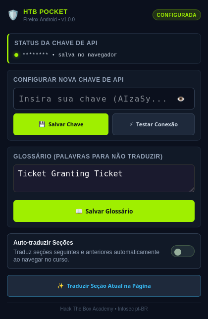

<div align="center">


# HTB Pocket Translator

**HTB Academy em português, com contexto técnico, no Firefox para Android.**


[Instalar](INSTRUCTIONS.md) · [Privacidade](SECURITY.md) · [Testes](CONTRIBUTING.md) · [Planejamento](PLANO_MELHORIAS.md)

</div>

Projeto independente da [NexusGuard-Labs](https://github.com/NexusGuard-Labs), com [Mid-night2026](https://github.com/Mid-night2026) como owner. Derivado da revisão `d3d6492` do [HTB Context Translator](https://github.com/NexusGuard-Labs/htb-context-translator).

<p align="center">
  
  <br><sub>Interface real no Firefox em perfil de teste. Nenhuma chave real aparece na captura.</sub>
</p>

## O que faz

Traduz automaticamente as seções do HTB Academy para pt-BR, incluindo avanço e retorno. O prompt distingue conceitos traduzíveis de jargões consagrados em inglês. Preserva código, comandos, links e formatação, sem acrescentar pares inglês/português redundantes.

- Popup com chave pessoal mascarada, teste da API e glossário opcional.
- Painel recolhível para deixar espaço à leitura e controles com área mínima de toque de 44 px.
- **Traduzir seleção** no próprio painel: selecione texto e toque no botão, sem precisar de clique direito.
- Alternância instantânea entre original e tradução, cache por sessão e progresso por lote.
- Cancelamento de respostas antigas ao mudar de seção; erros mantêm o original.

## Compatibilidade e estado

| Item | Situação |
|---|---|
| Navegador alvo | **Firefox para Android 142 ou superior** |
| Validação adicional | Firefox desktop 140+; testes do núcleo e de tela de 320 px em Chromium |
| Chrome comum no Android / Safari no iPhone | Este pacote não é destinado a esses navegadores |
| Instalação permanente | Exige um **XPI assinado pela Mozilla** |
| Pacote gerado aqui | XPI **sem assinatura**, para validação/desenvolvimento e envio à Mozilla |
| Aparelho Android físico | Ainda não validado neste ambiente |

O manifesto usa background por scripts, compatível com Firefox Android. A Mozilla informa que service workers de extensões ainda não são suportados nessa plataforma. [Referência](https://extensionworkshop.com/documentation/develop/developing-extensions-for-firefox-for-android/).

## Começar

1. Obtenha o XPI **assinado** pela organização ou siga o processo de assinatura em [INSTRUCTIONS.md](INSTRUCTIONS.md).
2. Instale no Firefox Android e permita o acesso ao HTB Academy e à API Gemini.
3. Abra **menu do Firefox → Extensões → HTB Pocket Translator**.
4. Cole sua chave Gemini, teste e salve. A chave fica no perfil desse navegador; não é importada do computador.
5. Abra uma seção do Academy. A tradução automática já vem ativada.

A extensão envia trechos e contexto ao Google Gemini para traduzir, junto com sua chave para autenticação. A organização não recebe essas informações pela extensão. Limites e custos dependem do seu projeto no Google AI Studio. [Detalhes de privacidade](SECURITY.md).

## Desenvolver e gerar o pacote

```bash
git clone https://github.com/NexusGuard-Labs/htb-pocket-translator.git
cd htb-pocket-translator
npm install
npx playwright-core install chromium
npm test
npm run lint:addon
npm run build
```

Saída: `dist/htb-pocket-translator-1.0.0-unsigned.xpi`. O empacotador inclui somente arquivos necessários, sem chaves, scripts de terminal ou testes. O pacote sem assinatura não deve ser anunciado como instalável permanentemente no Firefox estável.

Código da extensão: `HTB-Pocket-Translator/`. Testes: `tests/`. O prompt e os modelos ficam em `background.js` e `models.json`.

## Limites claros

A qualidade linguística depende da IA. Cinco exemplos sintéticos de terminologia foram avaliados na revisão de origem, incluindo distinção entre proxy reverso e forward proxy; isso não garante todas as respostas futuras. A aplicação preserva o DOM e rejeita respostas incompletas ou marcadores alterados.

A proteção contra outros tradutores sinaliza `notranslate` e detecta marcadores conhecidos do Google. Não muda preferências globais do navegador. Se outro tradutor já alterou o texto, restaure o original antes de usar a extensão.

[Contribuir](CONTRIBUTING.md) · [Código de conduta](CODE_OF_CONDUCT.md) · [Plano focado no objetivo](PLANO_MELHORIAS.md) · [Histórico](CHANGELOG.md) · [Licença MIT](LICENSE)

Sem afiliação oficial com Hack The Box, Mozilla ou Google.
